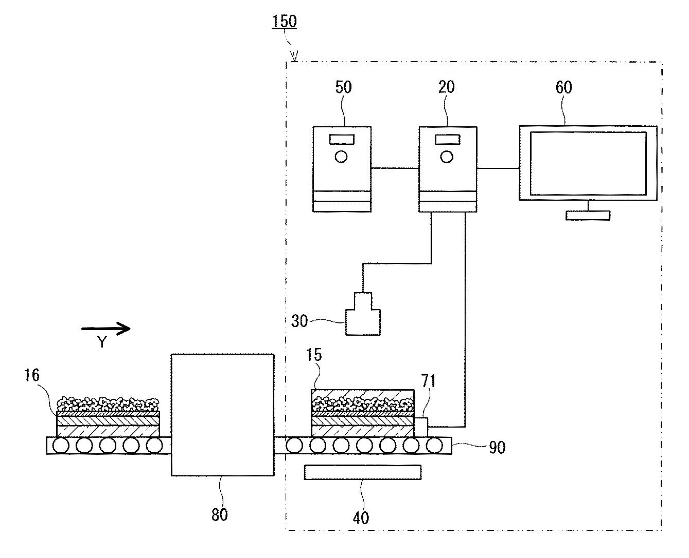
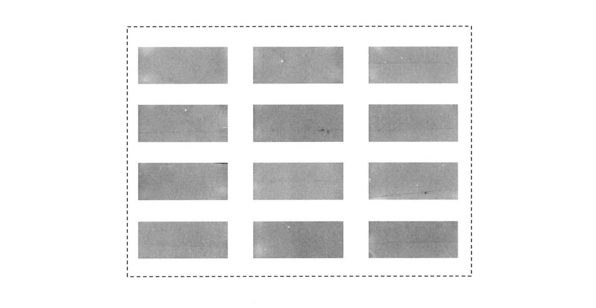
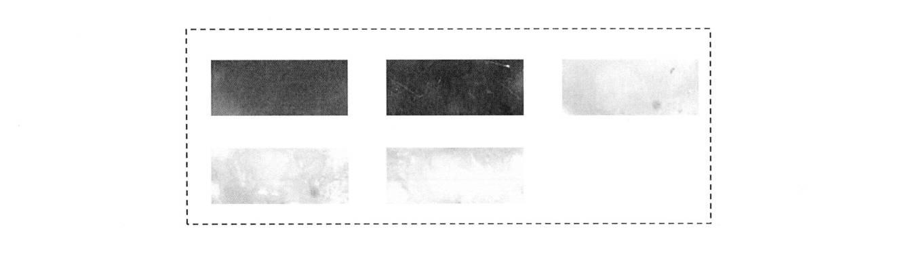

今回は過去に私が発明した**「人工知能（AI）によるペロブスカイト太陽電池の検査装置」**
（[特開2020-005473](https://www.j-platpat.inpit.go.jp/c1800/PU/JP-2020-005473/BAFBEA785A8A8F5D0D25B1ACFDC34927DE6CEA14938914035712A33DF6AFDD22/11/ja)）という特許について解説したいと思います。

### どんなことができるの？
一言でこの特許を表現すると、**完成したペロブスカイト太陽電池をカメラで撮影し、
AIによりその写真をもとに太陽電池の出来具合を調べる特許**です。

下記の図のようにライン上で流れてきた太陽電池（15番）を、
下のライト（40番）で照らし、上からカメラ（30番）で撮影します。
その画像をコンピューター（20番）の中あらかじめ学習済みの機械学習モデルに入力することで
その太陽電池の変換効率を予測することができるという仕組みです。

### なにがすごいの？
AIをつかうことで**太陽電池の画像だけで発電性能を瞬時に、かつ高い精度で予測できる**ことがすごい点です。

この検査装置のポイントはペロブスカイト太陽電池にあります。

ペロブスカイト太陽電池とは現在最も注目される次世代太陽電池です。
ペロブスカイト太陽電池は従来の太陽電池に匹敵する25%以上の高い変換効率を示すだけでなく、
従来の太陽電池と異なり、ペンキのように塗って作ることができるため、
低価格になる、曲げられる、軽くなる、といったこれまでにないメリットを有します。

しかしながら、塗ってつくるため**発電性能にばらつきが生じやすい**という、
これまでの太陽電池にないデメリットがありました。
つまり、同じようにつくっても高い変換効率と低い変換効率のものができてしまうということです。
購入した太陽電池が全然使い物にならなかったら困りますよね。
このばらつきの原因は、塗るときの乾燥条件や塗った液の広がり方などに応じて、
ペロブスカイト層の結晶の偏り、または膜厚の偏りが生じることに起因しています。
こうした偏りはペロブスカイト太陽電池の**色ムラ**として現れます。

例えば、（白黒で見にくいですが）変換効率が高いペロブスカイト太陽電池は、
以下のようにムラが少なくきれいですが、

変換効率が低いペロブスカイト太陽電池の写真は、
濃淡があったり、色が濃すぎたりと、目でみても違いがわかります。
これは従来の太陽電池にはない特徴です。

人が目で見ても判断できるということで
同じことが**AIでもできるのではないか？**と私は考えました。

そこで、400個のペロブスカイト太陽電池の写真と、
実際に測定した発電性能をニューラルネットワークを用いて学習したところ、
写真のみの情報で**変換効率が3%以下の誤差で予測できる**ことがわかりました。

太陽電池は、複数の層が積み重なってできておりますが
通常、太陽電池の発電性能を評価するためには、
すべての層を積み重ね、電極を配置して電気を流す必要があり、手間がかかります。
故に従来はすべての完成品を評価するには**膨大な時間がかかる**ため、
一部の完成品のみ検査することしかできませんでした。

一方、この方法であれば、電気を流すことなく**写真のみで瞬時に評価できる**ので、
すべての完成品を評価することができます。
さらに全部の層を積み重ねるよりも前に不良品を判断できるため、
使う材料を節約することも可能です。

このように材料・デバイス開発においても、
AIによってこれまでできなかったことが実現されつつあります。
今回は太陽電池の検査装置という少しマニアックな内容でしたが、
今後も**材料・デバイス×AI**の動向を解説したいと思います。