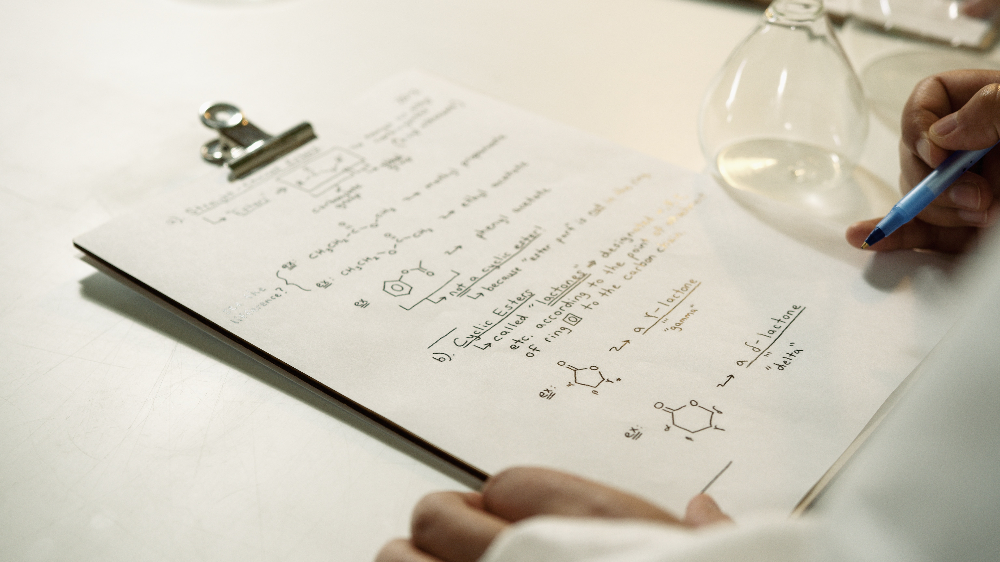
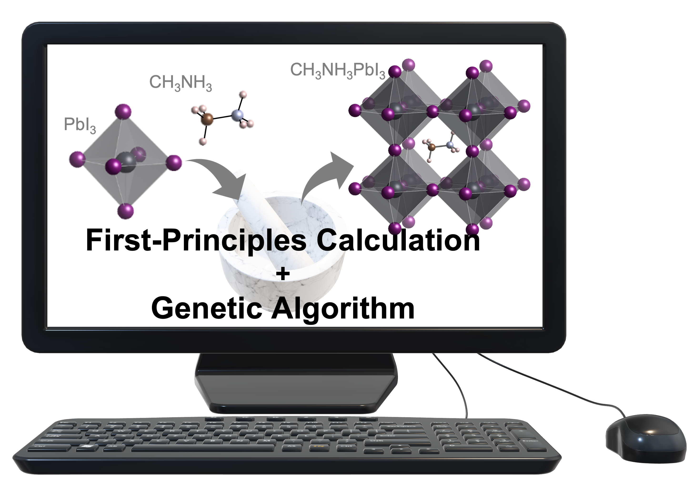

パナソニックの研究所で研究者として働く私が、これまでの経験から大事だと思うことが３つあります。今回はそのことについて書きたいと思います。

### 企業研究者にとって大事なことは？その１

企業の研究開発において私が大事だと思うことの一つ目は、**「オリジナリティ」**、つまり代替不可能な**唯一無二の研究者**でいることです。
このように考えるようになったのは、[こちら](https://yokoyamatomoyasu.github.io/researcher-life-2)の記事にも書いた通り入社して感じた危機感がきっかけでした。
私のような企業研究者が活躍し続けるためには、技術的優位性、つまりオリジナリティを保有しなければならないと思います。

AIとシミュレーションを組み合わせて材料探索をDX化する、いわゆるマテリアルズ・インフォマティクス（MI）が近年注目を集めています。私もMIの技術構築について取り組んでおりますが、材料科学だけでなくデータ科学の分野からも多くの研究者がMIの研究を行なっている昨今、自分のオリジナリティを発揮するのがますます難しくなっていると感じています。

### マテリアルズ・インフォマティクスにおける「オリジナリティ」とは？

こうしたMIの流行のなかでどのようにオリジナリティを発揮していけばよいのでしょうか？私のような材料科学者にとって、それは**「データ」**にあると思います。

MIの分野では材料に関するデータをAIに教え込むことで、鋭い勘や経験を持つ熟練の材料科学者のように革新的な材料を効率的に発見することが期待されています。機械学習に代表されるようなAIに教え込む技術は、まだ黎明期であり日進月歩でさまざまな手法が提案されています。いずればMIに最適な機械学習手法が見出されこうした技術が成熟すれば、誰しもがその技術を使って同じことができるようになると思います。

例えば、第一原理計算がそれに該当します。昔はさまざまな第一原理計算用のソフトがありましたが、精度や速度の観点から今ではGaussianやVASPといった代表的なソフトが広く普及し、これを購入すれば誰でも同じ結果を得ることができます。そうしたソフトの使い方をちょっと勉強すれば誰でもできてしまうのです。

では、MIにおいて自分にしかできない研究をするためにはどうしたらいいのでしょうか？それには**自分にしか作れないデータ**が重要になると思います。AIに教え込む方法は同じでも、教え込むことが異なれば、独自のAIを作り上げることができます。データ科学の分野でGAFAが時代を席巻しているのも、彼らが他の誰も持っていないオリジナルのデータをもっていることが一つの要因です。自分しか持っていないデータを持つことは、MIにおいて自分のオリジナリティを発揮するのに不可欠であると思います。それが自分あるいはその組織の強みになると思います。

### 唯一無二の研究者になるために

以上から、私は**自分にしか作れないデータを作る技術**こそがMIの「オリジナリティ」の源泉ではないかと考えます。例えば、私の場合には**「構造予測」**がそれにあたると考え、取り組みを推進しています。

第一原理計算では、材料を構成する原子同時がどのようにつながっているか、つまり「構造」がわからないと材料の物性を予測できません。通常は実験のデータベースなどから構造ファイルを取得して計算しますが、まだ発見されていない物質の構造ファイルは収録されていないため、そうした未知の物質を予測することはこれまで困難でした。

そこで、まだ発見されてない物質の「構造」を独自に予測できれば、自分にしか作ることができないデータになると考えました。予測された構造データに基づき第一原理計算やMIにより評価することで、他の人には真似できない革新的な新材料を生み出せる可能性があります。こうした自分にしか作れないデータが増えれば、自分にしか作れない高性能なAIを作ることもできます。ゆえに、私は構造予測、特に結晶構造生成に特に興味を持って研究を進めています。[こちら](../assets/pdf/p0115-2.pdf)にも私が取り組む結晶構造予測の一例を説明しておりますので、ご参考になれば幸いです。

唯一無二の研究者になるために、AI社会の源泉であるデータを生み出す技術の構築をこれからも続けたいと思います。

次回は、企業研究者として大切と思うことの二つ目である「異分野の融合」について書きたいと思います。

[企業研究者にとって大事だと思うこと Ⅰ](https://yokoyamatomoyasu.github.io/researcher-life-5)
