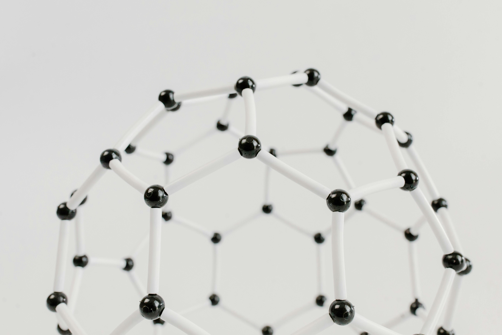

****

最近、僕は「多面体に基づいて結晶構造をデザインする」ということに興味があるのですが、今回はなぜそのような研究アプローチに至ったか？について背景にある想いを含め書いてみたいと思います。

先に結論から述べると、**本質に立ち戻ること**が最近の研究アプローチの根幹にあり、一本の論文に出会うことでそれを実現することができました。
以下ではそれを詳細に説明したいと思います。

### 偉大な先人たちと戦うためには

数年前、ある開発プロジェクトに参画することになった僕は、とにかくイオンが流れやすい固体材料、つまりすごいイオン伝導体を見つけろ、という開発テーマを担当することになりました。
僕の夢は「計算から新しい材料を発見し、エネルギー問題の解決に貢献する」ことなので、イオン伝導体に関しては素人でしたが、自分のやりたいことにマッチしたテーマでワクワクしたのを覚えています。

ただ、この分野を調べてみると、多くの先人たちがありとあらゆる研究をしており、素人の僕が立ち向かうのはかなり難しい世界であることがわかってきました。
イオン伝導体の歴史は古く、およそ100年前から研究が続く分野であり、多くの先人がさまざまなすごい材料を発見してきました。
また、僕の専門分野であるマテリアルズ・インフォマティクス（MI）による研究も近年多くの報告があり、僕もこうしたアプローチにもトライしてみたものの、目新しい結果は得られませんでした。

このように僕よりも知識も技術も上回る先人たちが沢山いる中で、「どうしたら偉大な先人たちが見つけられなかった材料を見つけられるか？」という問いに答えが出せず、悶々とした日々を送っていました。

### 本質に立ち戻ってみる

そこで少し視点を変え、**本質に立ち戻って**整理してみると、少し兆しが見えてきました。

イオン伝導度のような材料物性を決める根源的なパラメータは「組成」と「構造」があります。
「組成」はLi3YCl6のようにリチウムやイットリウムといった元素とその比率から決まり、多くの研究は、元素を変えたり比率を変えたりする、つまり組成をデザインすることで材料物性を改善してきました。
一方、「構造」は原子の並び方を意味しますが、構造は組成よりも複雑で、特に結晶構造ような３次元の構造体では人間が簡単に理解することが困難です。
従って、組成に比べ構造をデザインして材料物性を改善するというアプローチは圧倒的に少ないことに気がつきました。

最近はMIの進展により結晶構造の表現方法も進化しているものの、いろいろな機械学習手法を試してみると、まだまだ発展段階であり汎用的な手法はまだ確立されていないこともわかってきました。
さらに、僕の研究対象であったイオン伝導度という材料物性は、組成も重要ですが、構造がそれ以上に強い影響を与える物性であり、従来の組成デザインではまだ発見されいない新材料が眠っている可能性があると考えました。

### 人生を変える一本の論文との出会い

そうした結晶構造デザインに関する先行研究を調べていたところ、僕の**人生を変える**一本の論文に出会いました。
それは2015年に出版された"Design principles for solid-state lithium superionic conductors"という[コチラ](https://doi.org/10.1038/nmat4369)の論文です。
この著者のCeder先生はMIブームの発起人にもなったアメリカの超有名科学者です。

この論文は、第一原理計算を使ってイオン伝導体にとっての結晶構造の設計原理を明らかにしたという内容で、まさに僕がやってみたかった結晶構造デザインを彼らは実践していました。

特に僕が感銘を受けたのは、モデル化の鮮やかさです。
彼らは、結晶構造を多面体の集合体としてシンプルに分類し、イオン伝導に本質的に影響する構造的因子のみを切り出してモデル化することで、イオン伝導体に共通する結晶構造を明らかにしました。
具体的には、複雑なイオン伝導を四面体-四面体間、四面体-八面体間、八面体-八面体間のイオン伝導の3種類に分類し、そのイオンの伝導のしやすさを評価することで、BCC構造がイオン伝導体として適していることを明らかにしました。
このように複雑な現象を要素に分け、それを一つ一つ取り出して影響度を検証する、これは実験的には難しく、計算にしかできないことです。

このモデル化の方法を見て、本質的な要因を調べるためには必ずしも高尚な計算手法を必要ではなく、頭を使えば誰でもできる計算手法でも検証できることを学びました。
今でもこの論文のモデル化をお手本として、頭を使いながら計算するように心がけています。

そしてこの論文から、多面体に注目することでこれまで難しかった結晶構造デザインが実現できるのではないかと感じ、停滞していた研究が前に進み始めました。
この論文がなかったら、上記の結晶構造デザインは構想のままで終わっていたと思いますので、この論文との出会いが僕の人生を変えることになりました。

この論文と出会ったことにより、結晶構造デザインならば、これまでの組成デザインでは見つけられなかった新しいイオン伝導体を新参者の僕でも見つけられるかもしれない、という考えに至りました。

これをきっかけとして研究を進めてみた結果、幸運にも先人たちやこの論文の著者たちも見落としていた領域があることがわかり、最近公開した二つの研究事例（[コチラ](https://doi.org/10.48550/arXiv.2407.02838)と[コチラ](https://doi.org/10.48550/arXiv.2312.09060)）につながりました。
こうした多面体に基づく結晶構造デザインは、イオン伝導体だけでなく他の材料にも応用できる可能性があり、僕の研究者としての軸にしていきたと考えています。

このように、本質に立ち戻ることで一本の論文との出会い、偉大な先人たちとも戦えるアプローチが少しはできたかなと思っています。
新たな論文に人生を変えられたいと願いつつ、これからも論文ウォッチを続けていきたいと思います。