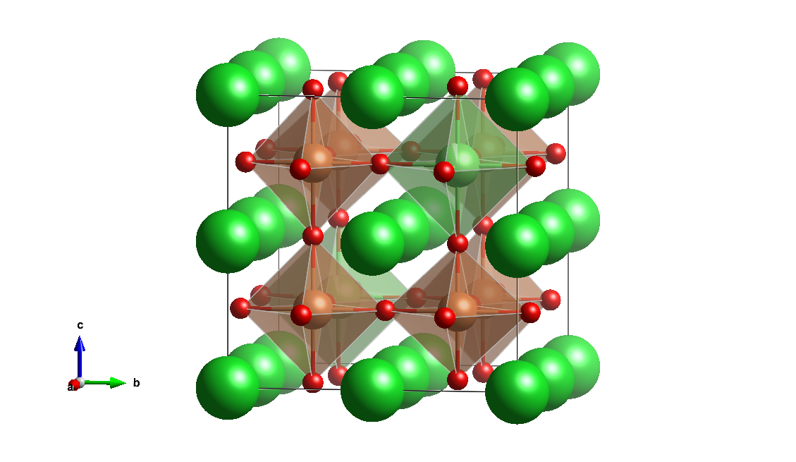

## プロフィール
- 名前  
横山智康（よこやまともやす）  

- 所属  
パナソニック株式会社 テクノロジー本部 主任研究員  

 

 

  

    

      
<a href="https://ja.wikipedia.org/wiki/Qiita" target="_blank">{タイトル}</a>

      
{description}

    

  

  

    <a href="https://ja.wikipedia.org/wiki/Qiita">{ドメイン名}</a>
  

}}}}}}

- 連絡先  
yokoyama.tomoyasu at_mark jp.panasonic.com  
(at_mark を ＠に置き換えてください）  

- 専門  
材料計算科学（第一原理計算）/ マテリアルズインフォマティクス  
無機材料 / 有機－無機ハイブリッド材料  
太陽電池 / 半導体 / 電池  

- 研究者IDサービス  
[google scholar](https://scholar.google.co.jp/citations?user=D-TalWsAAAAJ&hl=ja&oi=ao)  [researchmap](https://researchmap.jp/yokoyama_tomoyasu)

- 略歴  
2008-2012　京都大学 工学部 物理工学科  
2012-2014　京都大学大学院 工学研究科 材料工学専攻 修士課程  
2014-　　　パナソニック株式会社  
2019-　　　東京工業大学 科学技術創生研究院 フロンティア材料研究所 博士課程  

- 受賞歴  
[第45回（2018年秋季）応用物理学会講演奨励賞](https://www.jsap.or.jp/young-scientist-presentation-award/recipients45)  
[第30回日本MRS年次大会奨励賞](https://www.mrs-j.org/meeting2020/jp/prg/awardList.php)  

## 研究内容  
研究内容の詳細は[こちら](research.md)

## お知らせ  
日本物理学会2021年秋季大会にて発表予定

## 論文  
- <u>T. Yokoyama</u>, S. Ohuchi, T. Matsui, Y. Kaneko, T. Sasagawa, Low-Cost Computing of the Thermophysical Properties of Organic-Inorganic Halide Perovskites by Density Functional Theory Combined with the Three-Dimensional Reference Interaction Site Method. *J. Phys. Chem. C* **2021**, 45, 31. [https://doi.org/10.1021/acs.jpcc.1c01171](https://doi.org/10.1021/acs.jpcc.1c01171)  
- <u>T. Yokoyama</u>, S. Ohuchi, E. Igaki, T. Matsui, Y. Kaneko, T. Sasagawa, An Efficient Ab Initio Scheme for Discovering Organic-Inorganic Hybrid Materials by Using Genetic Algorithms. *J. Phys. Chem. Lett.* **2021**, 12, 2023-2028. [https://doi.org/10.1021/acs.jpclett.1c00087](https://doi.org/10.1021/acs.jpclett.1c00087)  
- Y. Miyamoto, S. Kusumoto, <u>T. Yokoyama</u>, Y. Nishitani, T. Matsui, T. Kouzaki, R. Nishikubo, A. Saeki, Y. Kaneko, High Current Density Sn-Based Perovskite Solar Cells via Enhanced Electron Extraction in Nanoporous Electron Transport Layers. *ACS Appl. Nano Mater.* **2020**, 3 (11), 11650-11657. [https://doi.org/10.1021/acsanm.0c02890](https://doi.org/10.1021/acs.jpclett.1c00087)  
- <u>T. Yokoyama</u>, Y. Nishitani, Y. Miyamoto, S. Kusumoto, R. Uchida, T. Matsui, K. Kawano, T. Sekiguchi, Y. Kaneko, Improving the Open-Circuit Voltage of Sn-Based Perovskite Solar Cells by Band Alignment at the Electron Transport Layer/Perovskite Layer Interface. *ACS Appl. Mater. Interfaces* **2020**, 12 (24), 27131-27139. [https://doi.org/10.1021/acsami.0c04676](https://doi.org/10.1021/acsami.0c04676)  
- T. Sekimoto, M. Suzuka, <u>T. Yokoyama</u>, Y. Miyamoto, R. Uchida, M. Hiraoka, K. Kawano, T. Sekiguchi, Y. Kaneko, Inverse Temperature Crystallization of Formamidinium Tin Iodide: Indirect Transition State and Restriction of Cation Motion. *Cryst. Growth Des.* **2019**, 20(2), 874-883. [https://doi.org/10.1021/acs.cgd.9b01262](https://doi.org/10.1021/acsami.0c04676)  
- T. Matsui, T. Yamamoto, T. Nishihara, R. Morisawa, <u>T. Yokoyama</u>, T. Sekiguchi, T. Negami, Compositional Engineering for Thermally Stable, Highly Efficient Perovskite Solar Cells Exceeding 20% Power Conversion Efficiency with 85°C/85% 1000 h Stability. *Adv. Mater.* **2019**, 31 (10). [https://doi.org/10.1002/adma.201806823](https://doi.org/10.1021/acsami.0c04676)  
- T. Matsui, <u>T. Yokoyama</u>, T. Negami, T. Sekiguchi, M. Saliba, M. Gratzel, H. Segawa, Effect of Rubidium for Thermal Stability of Triple-Cation Perovskite Solar Cells. *Chem. Lett.* **2018**, 47 (6), 814-816. [https://doi.org/10.1246/cl.180211](https://doi.org/10.1246/cl.180211)  
- T. Sekimoto, M. Suzuka, <u>T. Yokoyama</u>, R. Uchida, S. I. Machida, T. Sekiguchi, K. Kawano, Energy level diagram of HC(NH2)2PbI3 single crystal evaluated by electrical and optical analyses. *Phys. Chem. Chem. Phys.* **2018**, 20(3), 1373-1380. [https://doi.org/10.1039/C7CP07477H](https://doi.org/10.1039/C7CP07477H)  
- H. Hayashi, S. Katayama, T. Komura, Y. Hinuma, <u>T. Yokoyama</u>, K. Mibu, F. Oba, I. Tanaka, Discovery of a Novel Sn(II)-Based Oxide β-SnMoO4 for Daylight-Driven Photocatalysis. *Adv. Sci.* **2017**, 4 (1). [https://doi.org/10.1002/advs.201600246](https://doi.org/10.1002/advs.201600246)  
- <u>T. Yokoyama</u>, F. Oba, A. Seko, H. Hayashi, Y. Nose, I. Tanaka, Theoretical Photovoltaic Conversion Efficiencies of ZnSnP2, CdSnP2, and Zn1-XCdxSnP2 Alloys. *Appl. Phys. Express* **2013**, 6 (6). [https://doi.org/10.7567/APEX.6.061201](https://doi.org/10.7567/APEX.6.061201)  

## 学会発表・講演  
- <u>横山智康</u>，「DFT/3D-RISM 法による有機-無機ハイブリッド材料の有限温度での物性評価」 電気化学界面シミュレーションコンソーシアム2021年度第1回勉強会 (2021).  
- <u>横山智康</u>，大内暁，市川和秀，四橋聡史，金子幸広，笹川崇男，「3D-RISM-SCF法による全固体電池用固体電解質におけるイオン拡散経路の高速探索手法」 第68回応用物理学会春季学術講演会 16p-Z33-11 (2021).  
- <u>横山智康</u>，大内暁，松井太佑，金子幸広，笹川崇男，「Predicting the temperature dependence of properties of CH3NH3PbI3 by DFT/3D-RISM approach.」 第30回日本MRS年次大会 E-O9-014  (2020).  
- <u>T. Yokoyama</u>, Y. Nishitani, Y. Miyamoto, S. Kusumoto, T. Matsui, K. Kawano, Y. Kaneko, "Exploring the limit of open circuit voltage by a large band offset at the interface between electron transport layer and tin-based halide perovskite layer" 2019 MRS Fall Meeting & Exhibit EN08.06.21 (2019).  
- <u>横山智康</u>，大内暁，松井太佑，金子幸広，笹川崇男，「マテリアルズ・インフォマティクスによる有機－無機ハイブリッド材料の探索手法開発」 第4回フロンティア太陽電池セミナー (2019).  
- <u>横山智康</u>，大内暁，松井太佑，金子幸広，笹川崇男，「第一原理計算と遺伝的アルゴリズムによる鉛フリーの有機－無機ハイブリッド材料の状態図予測」 第80回応用物理学会秋季学術講演会 19a-E318-1 (2019).  
- <u>横山智康</u>，大内暁，松井太佑，井垣恵美子，笹川崇男，「第一原理計算と遺伝的アルゴリズムによる有機－無機ハイブリッド材料の状態図予測」 第66回応用物理学会春季学術講演会 10p-S423-1 (2019).  
- <u>横山智康</u>，大内暁，松井太佑，金子幸広，笹川崇男，「The phase diagram prediction of organic-inorganic hybrid materials.」 第28回日本MRS年次大会 D2-O20-003 (2018).  
- <u>横山智康</u>，大内暁，松井太佑，井垣恵美子，笹川崇男，「第一原理計算と遺伝的アルゴリズムによる有機－無機ハイブリッド材料の状態図予測」 第79回応用物理学会秋季学術講演会 19p-437-12 (2018).  
- <u>T. Yokoyama</u>, M. Suzuka, Y. Miyamoto, T. Sekimoto, R. Uchida, T. Sekiguchi, K. Kawano, "The bandgap narrowing of organic-inorganic hybrid perovskite by the orientation of organic cations" Perovskite Thin Film Photovoltaics (ABXPV17) (2017).  
- 宮本佳子，<u>横山智康</u>，鈴鹿理生，矢澤宏次，河野謙司，「ペロブスカイト型有機-無機ハイブリッド材料中の有機分子の付加的結合状態解析への固体NMRの応用」 第61回固体NMR・材料フォーラム P2 (2017).  
- 林博之，片山翔太，古村尭大，日沼洋陽，<u>横山智康</u>，大場史康，田中功，「二価スズ複合酸化物における光触媒材料探索と電子状態」 日本金属学会2017年春季講演大会 274 (2017).  
- 藤田達也，岡田隆宏，<u>横山智康</u>，熊谷悠，大場史康，田中功，「第一原理計算による中間バンド型太陽電池の光吸収層の設計」 日本金属学会2014年秋季講演大会 280 (2014).  
- 藤田達也，<u>横山智康</u>，熊谷悠，大場史康，田中功，「第一原理計算によるCu2O基中間バンド型太陽電池光吸収層材料の探索」 日本金属学会2014年春季講演大会 211 (2014).  
- <u>横山智康</u>，藤田達也，林博之，大場 史康，田中功，「第一原理計算による中間バンド型太陽電池の光吸収層の設計」 日本金属学会2013年秋季講演大会 280 (2013).  
- <u>横山智康</u>，藤田達也，林博之，大場 史康，田中功，「第一原理計算によるCu2O基中間バンド型太陽電池の光吸収層の設計」 日本金属学会2013年春季講演大会 271 (2013).  

## 特許  
- パナソニックIPマネジメント株式会社．楠本将平，河野 謙司，<u>横山智康</u>．「太陽電池」WO2021/100237．2021-05-27．
- パナソニックIPマネジメント株式会社．<u>横山智康</u>，西谷雄，楠本将平，宮本唯未．「太陽電池」WO2020/213196．2020-10-22．
- パナソニックIPマネジメント株式会社．松井太佑，菊地諒介，<u>横山智康</u>，大場史康．「太陽電池」WO2020/208843．2020-10-15．
- パナソニックIPマネジメント株式会社．<u>横山智康</u>，松井太佑．「太陽電池」WO2020/105207．2020-05-28．
- パナソニックIPマネジメント株式会社．<u>横山智康</u>，河野 謙司，宮本唯未．「太陽電池」特開2020-13982．2020-01-23．
- パナソニックIPマネジメント株式会社．<u>横山智康</u>，若杉健介，松井太佑．「太陽電池の評価装置および太陽電池の評価方法」 特開2020-5473．2020-01-09．
- パナソニックIPマネジメント株式会社．鈴鹿理生，<u>横山智康</u>，松井太佑．「光吸収材料及びそれを用いた太陽電池」特開2019-125775．2019-07-25．
- パナソニックIPマネジメント株式会社．<u>横山智康</u>，鈴鹿理生．「光吸収材料およびそれを用いた太陽電池」特開2019-125774．2019-07-25．
- パナソニックIPマネジメント株式会社．関本健之，鈴鹿理生，<u>横山智康</u>，宮本佳子，松井太佑．「光吸収材料及びそれを用いた太陽電池」 特開2019-21912．2019-02-07．
- パナソニックIPマネジメント株式会社．<u>横山智康</u>，鈴鹿理生，宮本  佳子，内田隆介．「光吸収材料およびそれを用いたペロブスカイト太陽電池」 特開2018-127531．2018-08-16．
- パナソニックIPマネジメント株式会社．<u>横山智康</u>，鈴鹿理生，宮本  佳子，内田隆介．「光吸収材料およびそれを用いたペロブスカイト太陽電池」 特開2018-129379．2018-08-16．
- パナソニックIPマネジメント株式会社．鈴鹿理生，内田隆介，<u>横山智康</u>．「光吸収材料およびそれを用いた太陽電池」 特開2017-199893．2017-11-02．
- パナソニックIPマネジメント株式会社．大内暁，杉本裕太，久米俊郎，<u>横山智康</u>．「全固体リチウムイオン二次電池、および、その製造方法」 特開2016-225281．2016-12-28．
