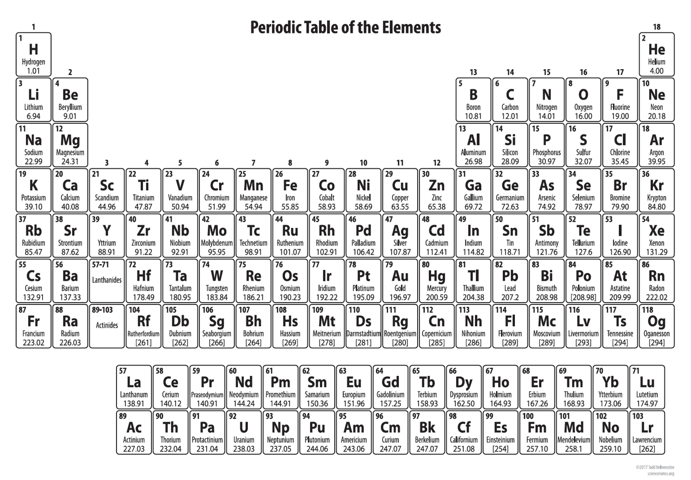
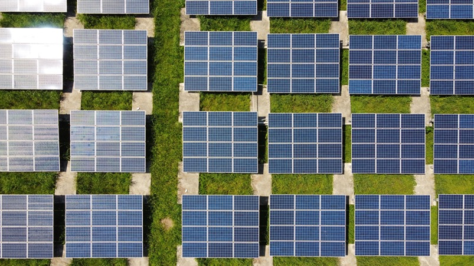

### はじめに

私は「素材」「材料」「マテリアル」の研究開発に従事しております材料科学者です。

「素材」はテクノロジーの源泉であり、社会の基盤です。
ノーベル賞を受賞した青色発光ダイオード（2014年）やリチウムイオン電池（2019年）も、窒化ガリウム（GaN）やコバルト酸リチウム（LiCoO2）というこれまでにない新しい「素材」の発見・開発が、デバイスを劇的に進化させ、人々の暮らしを変えるテクノロジーに繋がりました。革新的な素材を見つけることができれば社会を変えられる、そんな魅力が素材の研究開発にはあります。

しかしながら、こうしたノーベル賞級の新素材を見つけることは非常に困難です。
そのことを、こちらの周期表を例に説明します。中学高校の理科の授業で一度は見たことがあるのではないでしょうか。

この世の中に存在する物資は、この周期表にある元素から構成されており、我々材料科学者はこの周期表から元素を選択して素材を作っています。
中学生までで覚えるのは20元素くらいまでですが、我々はこの周期表全体の80種類の元素の中から選んで素材を作ります。
例えば、この中から3つの元素を選んで素材を作る、といったことをしますが、
そのような組み合わせは、元素の比率の組み合わせも考慮すると800万通りもあるんです。
それが4つ、5つになれば、1億通りを超える膨大な組み合わせが存在します。
このような広大な砂漠の中から宝探しをするようなことを、材料研究者は日々しているのです。

こうした新素材の探索は、これまでは研究者の経験と勘に頼って開発を進めるしかありませんでした。
そのため、熟練の研究者はこれまでの経験に従い成功を収めてきましたが、経験乏しい研究者は手当たり次第に開発を進める事しかできず、新素材の発見を偶然に委ねることしかできず、時間がかかる要因となっていました。

そこで、近年発達が目覚しい人工知能・AIやシミュレーションにより、素材・材料開発をデシタルトランスフォーメーション（DX）する「マテリアルズ・インフォマティクス」が、こうした課題を解決すると大きな注目を集めています。

私は、「情報」と「素材」を組み合わせ、電子レベルから現象を紐解き、素材の本質を理解することで、新素材を発見しエネルギー問題などの社会課題の解決に貢献できればと考えております。

### 研究内容

私は、これまで次世代の太陽電池やリチウムイオン電池などのクリーンエネルギーデバイスの材料開発に携わってきました。
特に、「マテリアルズ・インフォマティクス」の手法を新たに構築することで、次世代の太陽電池として注目される「ペロブスカイト太陽電池」の効率的な開発を行っています。

具体的な研究内容は[こちら](../assets/pdf/p0115-2.pdf)をご覧ください。