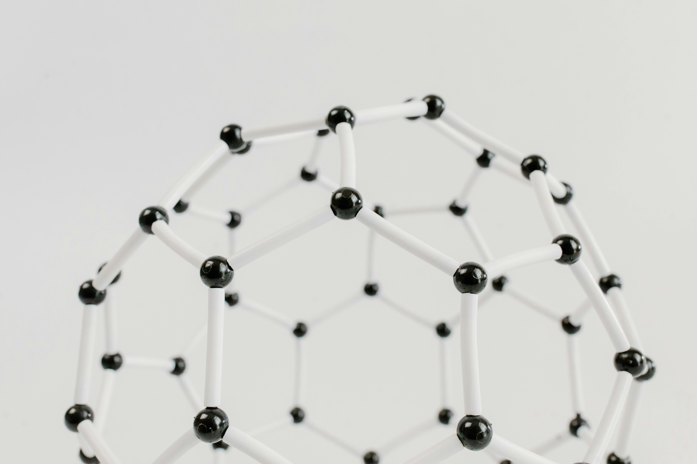

### はじめに

私は計算科学に基づき「素材」「材料」「マテリアル」の研究開発に従事しております計算材料科学者です。

「素材」はテクノロジーの源泉であり、社会の基盤です。
ノーベル賞を受賞した青色発光ダイオード（2014年）やリチウムイオン電池（2019年）も、窒化ガリウム（GaN）やコバルト酸リチウム（LiCoO2）というこれまでにない新しい「素材」の発見・開発が、デバイスを劇的に進化させ、人々の暮らしを変えるテクノロジーに繋がりました。革新的な素材を見つけることができれば社会を変えられる、そんな魅力が素材の研究開発にはあります。

しかしながら、こうしたノーベル賞級の新素材を見つけることは非常に困難です。
そのことを、こちらの周期表を例に説明します。中学高校の理科の授業で一度は見たことがあるのではないでしょうか。

この世の中に存在する物質は、この周期表にある元素から構成されており、我々材料科学者はこの周期表から元素を選択して素材を作っています。
中学生までで覚えるのは20元素くらいまでですが、我々はこの周期表全体の80種類の元素の中から選んで素材を作ります。
例えば、この中から3つの元素を選んで素材を作る、といったことをしますが、
そのような組み合わせは、元素の比率の組み合わせも考慮すると800万通りもあります。
それが4つ、5つになれば、1億通りを超える膨大な組み合わせが存在します。
このような広大な砂漠の中から宝探しをするようなことを、材料研究者は日々しています。

こうした新素材の探索は、これまでは研究者の経験と勘に頼って開発を進めるしかありませんでした。
そのため、熟練の研究者はこれまでの経験に従い成功を収めてきましたが、経験乏しい研究者は手当たり次第に開発を進める事しかできず、新素材の発見を偶然に委ねることしかできず、時間がかかる要因となっていました。

そこで、近年発達が目覚しい人工知能・AIやシミュレーションにより、材料開発をデシタルトランスフォーメーション（DX）する「マテリアルズ・インフォマティクス」が、こうした課題を解決すると大きな注目を集めています。

私は、**「電子レベルから現象を紐解き材料の本質を理解することで、新材料を創出し、社会課題の解決に貢献する」**ことを目的に研究しております。

### 研究内容：結晶構造デザイン

私は素材の中でも特に結晶材料と呼ばれる素材の開発に携わってきました。
結晶とは、原子や分子などが規則正しく並んだ物質のことで、ダイヤモンドやルビーといった宝石がよく知られています。
先に挙げた青色発光ダイオードに使われるGaNや、リチウムイオン電池に使われるLiCoO2も結晶材料であり、クリーンエネルギーデバイスにおけるキーとなる素材です。

結晶材料の面白いところは、同じ元素が選ばれてもその原子の並び方、つまり結晶構造が変わることで、材料物性が大きく変わることです。
例えば、ヨウ化銀（AgI）はα相とβ相という異なる2種類の結晶構造を持ち、β相の構造ではイオンが伝導しませんが、α相の構造ではイオンが固体中を高速で移動できるようになります。
よって、原子の並び方を制御し結晶構造をうまくデザインすることで、所望の材料物性を持つ材料を見つけることができ、革新的なデバイスの創出につながります。

しかし、こうした結晶構造デザインはこれまで困難でした。
その理由は、結晶構造があまりにも複雑すぎるためです。

3次元空間への原子の並べ方は、原子の数が増えるにつれ膨大な候補が存在するため、狙いの結晶構造を探すことは先の元素を選び出すことよりももっと大変です。
また、人間は外界の情報を網膜から取り入れられますが網膜像は2次元像になってしまっているため、結晶構造のような3次元構造体の認知は本質的に苦手という点も、結晶構造の理解を妨げています。

逆に言えば、こうした複雑性をうまく紐解き、結晶構造と材料物性の関係性を理解することができれば、これまで見つけることが難しかった新素材を発見できる可能性があります。

私は計算科学をベースとし、データ科学や数学と融合させることで、こうした結晶構造デザインに取り組んでいます。
- 計算科学と機械学習を用いた結晶構造をデザインする手法の開発
- 数学を用いた多面体から結晶構造をデザインする手法の開発
- 多面体に基づいたイオン伝導体の探索

こうした開発手法を太陽電池、バッテリー、キャパシタなどのクリーンエネルギーデバイスに適用し、効率的な新材料創出を試みています。
結晶構造デザインのペロブスカイト太陽電池への応用事例は[こちら](../assets/pdf/p0115-2.pdf)を、材料科学と数学の融合による結晶構造デザインの事例は[こちら](https://doi.org/10.5940/jcrsj.66.60)ご覧ください。